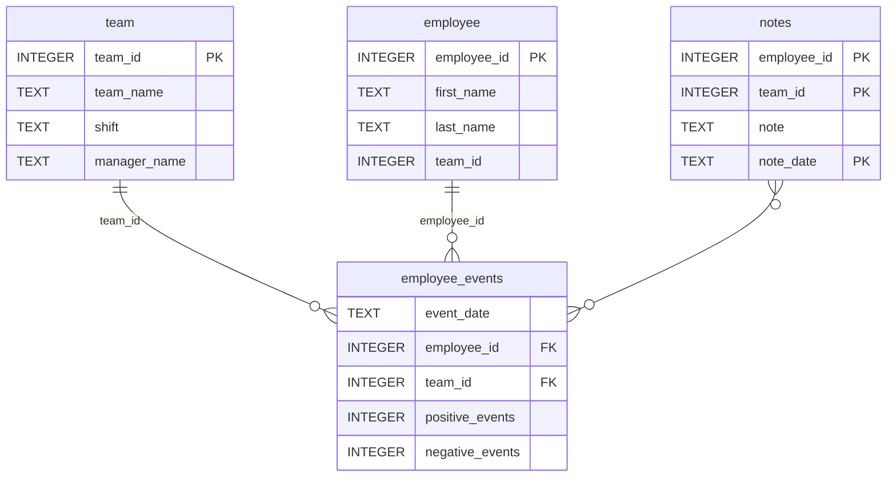

# Software Engineering for Data Scientists 
# Proyecto actualizado

### ## Notas 
# dsnd-dashboard-project

Este proyecto es un dashboard interactivo desarrollado para el programa Data Scientist Nanodegree de Udacity, utilizando `FastHTML` y `SQLite`.

## 📦 Estructura del proyecto
```
├── README.md
├── assets
│   ├── model.pkl
│   └── report.css
├── env
├── python-package
│   ├── employee_events
│   │   ├── __init__.py
│   │   ├── employee.py
│   │   ├── employee_events.db
│   │   ├── query_base.py
│   │   ├── sql_execution.py
│   │   └── team.py
│   ├── requirements.txt
│   ├── setup.py
├── report
│   ├── base_components
│   │   ├── __init__.py
│   │   ├── base_component.py
│   │   ├── data_table.py
│   │   ├── dropdown.py
│   │   ├── matplotlib_viz.py
│   │   └── radio.py
│   ├── combined_components
│   │   ├── __init__.py
│   │   ├── combined_component.py
│   │   └── form_group.py
│   ├── dashboard.py
│   └── utils.py
├── requirements.txt
├── start
├── tests
    └── test_employee_events.py
```

### employee_events.db




---


# 📊 Dashboard de Employee Events

## Instrucciones para ejecutar el proyecto

## 1. Clonar el repositorio:
git clone https://github.com/diegomejialleras99/dsnd-dashboard-project.git

cd dsnd-dashboard-project

## 2. (Opcional) Crear y activar entorno virtual:
### En Windows:
python -m venv venv

venv\Scripts\activate

### En Mac/Linux:
python -m venv venv

source venv/bin/activate

## 3. Instalar dependencias:
pip install -r requirements.txt

## 4. Ejecutar la aplicación:
python report/dashboard.py

La aplicación estará disponible en: [http://localhost:5001](http://localhost:5001)

---


