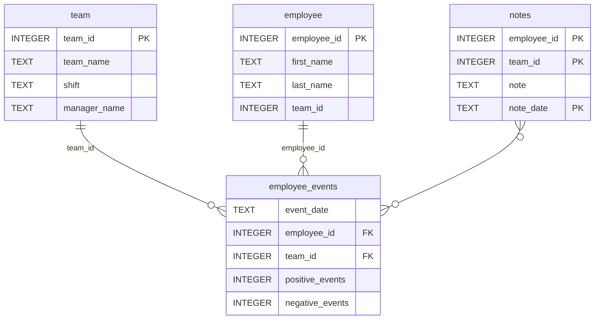

# Software Engineering for Data Scientists 
# Proyecto actualizado

### ## Notas 
# dsnd-dashboard-project

Este proyecto es un dashboard interactivo desarrollado para el programa Data Scientist Nanodegree de Udacity, utilizando `FastHTML` y `SQLite`.

## 📦 Estructura del proyecto
```
├── README.md
├── assets
│   ├── model.pkl
│   └── report.css
├── env
├── python-package
│   ├── employee_events
│   │   ├── __init__.py
│   │   ├── employee.py
│   │   ├── employee_events.db
│   │   ├── query_base.py
│   │   ├── sql_execution.py
│   │   └── team.py
│   ├── requirements.txt
│   ├── setup.py
├── report
│   ├── base_components
│   │   ├── __init__.py
│   │   ├── base_component.py
│   │   ├── data_table.py
│   │   ├── dropdown.py
│   │   ├── matplotlib_viz.py
│   │   └── radio.py
│   ├── combined_components
│   │   ├── __init__.py
│   │   ├── combined_component.py
│   │   └── form_group.py
│   ├── dashboard.py
│   └── utils.py
├── requirements.txt
├── start
├── tests
    └── test_employee_events.py
```

### employee_events.db




---


# 📊 Dashboard de Employee Events

## 1️⃣ Clonar el repositorio:
```bash
git clone https://github.com/diegomejialleras99/dsnd-dashboard-project.git
cd dsnd-dashboard-project
```

## 2️⃣ Instalar dependencias:
```bash
pip install -r requirements.txt

```
Esto instalará el paquete `employee_events` y todas sus dependencias, incluyendo `python-fasthtml==0.8.0`.

## 3️⃣ Iniciar el dashboard:
```bash
python report/dashboard.py
```

La aplicación estará disponible en:

```
http://localhost:5001
```

## 💡 Notas
- Asegúrate de usar **Python 3.10+**.
- La base de datos `employee_events.db` ya está incluida en el proyecto.
- No necesitas configurar nada adicional; simplemente sigue los pasos anteriores.

Antes de ejecutar el dashboard, instala el paquete local ejecutando estos comandos desde la raíz del repositorio.
